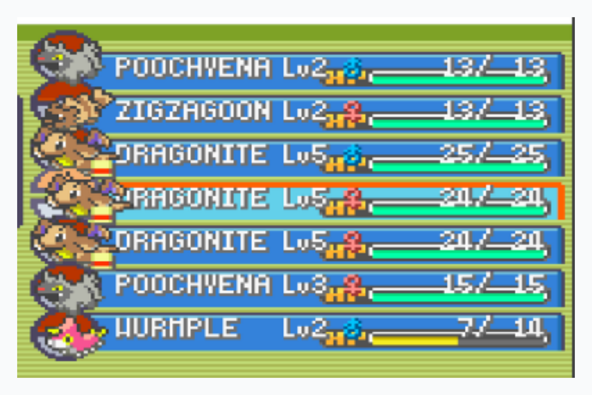

# Algoritmo de Centro Pokemon
O objetivo desse projeto foi criar um código para armazenar o máximo de informações possível dos pokemons da imagem abaixo e ao final, para cada um, exiba uma mensagem de saída escrita o nome do pokemon concatenado com "Cadastrado com sucesso".

  

